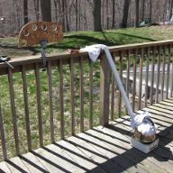

# About Me

Originally from Connecticut, I am currently a chemistry graduate student working on piezoelectrics for Professor [Geoffrey Hutchison](https://hutchisonlab.org/) at the [University of Pittsburgh](https://www.pitt.edu/). Previously, I attended [Boston College](https://www.bc.edu/) where I majored in chemistry and minored in math; much of my time was spent in the chemistry lab researching metal--organic frameworks for Professor [Frank Tsung](https://sites.bc.edu/frank-tsung/). Besides chemistry, I have interests in running, nature/ecology, hiking, and photography.

Find me on [Google Scholar](https://scholar.google.com/citations?user=pO0-qfoAAAAJ), [ORCID](https://orcid.org/0000-0003-2264-7983), [Athlinks](https://www.athlinks.com/athletes/267110779), [Strava](https://www.strava.com/athletes/18985791), [Smashrun](https://smashrun.com/cpetroff), [Flickr](https://www.flickr.com/photos/cpetroff), [500px](https://500px.com/cpetroff), [YouTube](https://www.youtube.com/christopherpetroff), and [GitHub](https://github.com/petroffc).

# ACS Student Chapter of Boston College

During the summer of 2014, a few friends and I restarted the American Chemical Society (ACS) Student Chapter on campus. While a chemistry club has existed on campus since 1926 and been recognized by ACS since 1947, the club had not been active for nearly a decade. The club's goal is to build a better sense of community among chemistry majors and create a low-key environment where they can gather in a non-academic setting. During my senior year, I served as the chapter's Vice President and Webmaster. For more information, please visit the chapter's website: [bc.chem.club](https://bc.chem.club/).

# Camp Workcoeman

I worked at Camp Workcoeman, a Boy Scout camp in New Hartford, Connecticut, every summer from 2008 until 2015. I worked in the Nature Lodge for my first four summers before serving as the director of the Tenderfoot's Compass program for three summers; I spent my final summer working as a Camp Comissioner. The Tenderfoot's Compass is a program for first year Scouts to work together as a patrol and learn many of the skills they need to achieve the ranks on Tenderfoot, Second Class, and First Class. Camp has a special place in my heart and is where I have made many of my best friends. For more information, please visit the camp's website: [campworkcoeman.org](https://campworkcoeman.org/).

# Running

In high school, I ran cross country and long distance track. My senior year, I finished third in the Founders League Cross Country Championship. On the track, I mainly ran the 1500 meter and the 3000 meter; I placed ninth at New Englands in the latter. After high school, I took up marathoning. I have run eleven marathons, including the Boston, Chicago, and New York Marathons. My best time is 2:36:57 which is an average pace of 5:59 per mile for the 26.22 miles. As a grad student, I now run with [Pitt Club XC](https://www.pittclubxc.com/). You can find my times on [Athlinks](https://www.athlinks.com/athletes/267110779).

# Cedar Strip Canoe

In the spring of my senior year of high school at [Taft](https://www.taftschool.org/), I built a cedar strip canoe as my senior project. The canoe is made out of thin strips of cedar glued together and covered with a fiberglass and epoxy sheath.

{:data-sbox="canoe"}
{:data-sbox="canoe"}
{:data-sbox="canoe"}
{:data-sbox="canoe"}
{:data-sbox="canoe"}
{:data-sbox="canoe"}
{:data-sbox="canoe"}
{:data-sbox="canoe"}
{:data-sbox="canoe"}
{:data-sbox="canoe"}
{:data-sbox="canoe"}
{:data-sbox="canoe"}
{:data-sbox="canoe"}
{:data-sbox="canoe"}
{:data-sbox="canoe"}
{:data-sbox="canoe"}
{:data-sbox="canoe"}
{:data-sbox="canoe"}
{:data-sbox="canoe"}

